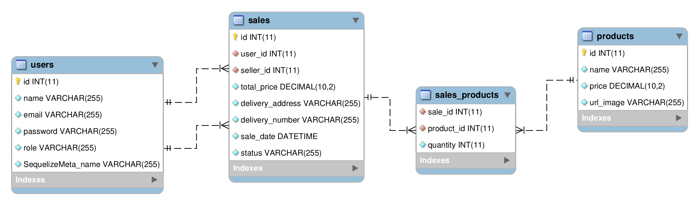

# APP DE DELIVERY
Esta é uma aplicação Full-Stack que gerência pedidos e entregas de bebidas, desenvolvida por meu grupo e eu, durante o curso de Desenvolvimento Web Full-Stack da [Trybe](https://www.betrybe.com/).

---
## Banco de Dados
<details>
<summary></summary>

O banco de dados utilizado foi o **MySQL**, um banco relacional, estruturado da seguinte forma:



### **Tabelas**
  - **users**:
    - Armazena os dados das pessoas usuárias, tanto compradores quanto vendedores.
  - **sales**:
    - Armazena as informações referentes as vendas, quem comprou, quem vendeu, onde foi entregue, a data da compra e o valor total.
  - **sales_products**:
    - Tabela intermediária para a relação N:N entre vendas e produtos, também armazena a quantidade vendida do produto.
  - **products**:
    - Armazena as informações referentes aos produtos, como nome, preço e sua imagem.

</details>

---
## Back-End
<details>
<summary></summary>

Desenvolvido em **Node.js**, utilizando **Express** com **Sequelize**.

### Endpoints
#### POST /login :
 - Responsável pelo login de usuários cadastrados.

    Entrada:
    ```json
    "body": {
      "email": "string",
      "password": "string",
    }
    ```

    Saida:
    ```json
    {
      "id": "number",
      "name": "string",
      "email": "string",
      "role": "string",
      "token": "token jwt"
    }
    ```

#### POST /register :
  - Responsável por registrar novos usuários, realizando a validação das informações. A senha é codificada usando **md5**, antes de salavr no banco de dados.

    Entrada:
    ```json
    "body": {
      "name": "string",
      "email": "string",
      "password": "string",
      "role": "string",
    }
    ```

    Saida:
    ```json
    {
      "name": "string",
      "email": "string",
      "role": "string",
      "token": "token jwt",
    }
    ```

#### POST /admin/register :
  - Similar a *user/register*, porém o cadastro é ralizado por uma pessoa admin.

    Entrada:
    ```json
    "headers": {
      "authorization": "token jwt valido"
    },
    "body": {
      "name": "string",
      "email": "string",
      "password": "string",
      "role": "string",
    }
    ```

    Saida:
    ```json
    {
      "name": "string",
      "email": "string",
      "role": "string",
      "token": "token jwt",
    }
    ```

#### GET /sellers :
  - Retorna todas as pessoas usuárias cadastradas como vendedoras.

    Saida:
    ```json
    {
      "id": "number",
      "name": "string",
    }
    ```

#### POST /sales :
  - Rsponsavel por registrar novas vendas.

    Entrada:
    ```json
      "headers": {
        "authorization": "token jwt valido"
      },
      "body": {
        "name": "string",
        "sellerId": "number",
        "totalPrice": "decimal",
        "deliveryAddress": "string",
        "deliveryNumber": "string",
        "products": ["Array de produtos"],
      }
    ```
    Saida:
    ```json
    {
      "newOrderId": "number",
    }
    ```

#### GET /sales?id :
  - Retorna uma lista das compras referentes ao id pessoa usuária.

    Entrada:
    ```json
      "query": {
        "id": "string"
      }
    ```
    Saida:
    ```json
    ["Lista de objetos, cada objeto é uma compra"]
    ```

#### GET /sales/:id :
  - Retorna a venda referente ao id informado.

    Entrada:
    ```json
      "params": {
        "id": "string"
      }
    ```
    Saida:
    ```json
      {
        "userID": "number",
        "sellerId": "number",
        "totalPrice": "decimal",
        "deliveryAddress": "string",
        "deliveryNumber": "string",
        "saleDate": "date",
        "status": "string",
        "seller": "informações do vendedor",
        "users": "informações do comprador",
        "products": ["Array de produtos"],
      }
    ```

#### GET /seller/orders :
  - Retorna as vendas referentes a um vendedor especifico:

    Entrada:
    ```json
      "headers": {
        "authorization": "token jwt valido"
      },
    ```
    Saida:
    ```json
    ["Lista de objetos, cada objeto é uma venda"]
    ```

#### PATCH /sales/:id :
  - Responsável por alterar o status de um pedido

    Entrada:
    ```json
      "params": {
        "id": "string",
      },
      "body": {
        "status": "novo status",
      }
    ```
    Saida:
    ```json
      {
        "status": "novo status",
      }
    ```

#### GET /products e GET /customer/products :
  - Retorna uma todos os produtos registrados no banco.

      Saida:
    ```json
    [
      ...,
      {
        "id": "number",
        "name": "string",
        "price": "decimal",
        "urlImage": "string",
      },
      ...,
    ]
    ```

#### **O que foi utilizado**
  - Node.js, Express, Sequelize;
  - Md5, JsonWebToken, Cors;
  - Mysql2;
  - Mocha, Chai, Chai-http, Sinon;

</details>

---
## Front-End
<details>
<summary></summary>

Desenvolvido em **React.js**.

### **O que foi utilizado**
  - React, ContextAPI;
  - CSS3, Slick Carousel;
  - React-Router-Dom, Axios;

</details>

---